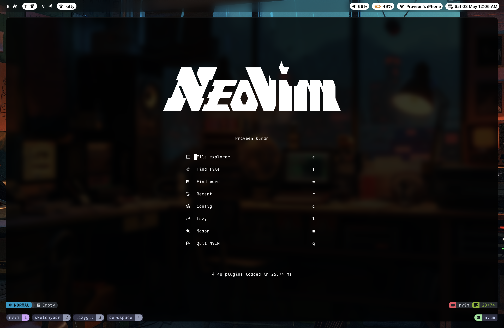
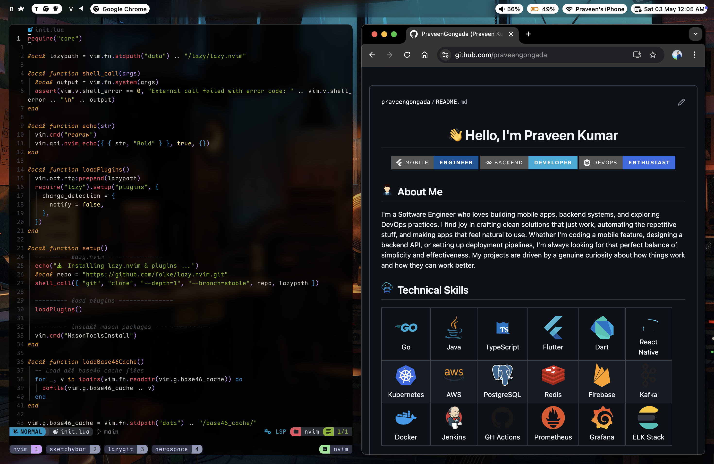

<div align="center">


<br/>


<a href="https://opensource.org/licenses/MIT"></a>

_A carefully curated collection of configuration files for a productive development environment_

</div>

## 📸 Screenshots

<div align="center">
  
  
</div>

_For more screenshots, see [Showcase](docs/showcase.md)_

## 📦 What's Inside

This repository contains configuration files for various tools and applications:

- **[zshrc](zshrc/)** - Z Shell configuration
- **[nvim](nvim/)** - Neovim configuration
- **[tmux](tmux/)** - Terminal multiplexer configuration
- **[ghostty](ghostty/)** - GPU-accelerated terminal emulator
- **[kitty](kitty/)** - GPU-based terminal emulator
- **[wezterm](wezterm/)** - GPU-accelerated cross-platform terminal emulator
- **[lazygit](lazygit/)** - Terminal UI for git commands
- **[sketchybar](sketchybar/)** - macOS status bar replacement
- **[aerospace](aerospace/)** - Window manager for macOS
- **[yazi](yazi/)** - Terminal file manager
- **[oh-my-posh](oh-my-posh/)** - Prompt theme engine
- **[homebrew](homebrew/)** - Package manager backup
- **[fonts](fonts/)** - Custom fonts collection
- **[wallpapers](wallpapers/)** - Custom wallpapers

## ⚡ Quick Start

Run this single command to install everything:

```bash
curl -fsSL https://raw.githubusercontent.com/PraveenGongada/dotfiles/main/setup.sh | bash
```

That's it! The installer handles everything automatically, including Homebrew installation, package setup, and dotfiles configuration.

## 🛠️ Installation Options

### Default Installation

The installer sets up:

- Homebrew package manager
- Development tools (Neovim, Tmux, Git, etc.)
- Shell configuration (Zsh with custom theme)
- Window management (AeroSpace, SketchyBar)
- Terminal applications (Yazi, Lazygit)
- Custom fonts and themes

### Custom Installation

Use flags to customize the installation:

```bash
# Skip package installation
./setup.sh --no-packages

# Verbose output with automatic confirmation
./setup.sh --verbose --force

# Use a different repository
DOTFILES_REPO=username/dotfiles ./setup.sh

# Skip backups for faster installation
./setup.sh --skip-backup
```

### Manual Installation

If you prefer to clone the repository first:

```bash
git clone https://github.com/PraveenGongada/dotfiles.git ~/dotfiles
cd ~/dotfiles
./setup.sh
```

## 🔧 Post-Installation

After installation:

1. **Restart your terminal** to load the new shell configuration
2. **Install Tmux plugins**: Open tmux and press `Ctrl+Space + I`

## 🚨 Troubleshooting

The installer includes built-in recovery features:

**Resume interrupted installation:**

```bash
# Simply re-run the installer
./setup.sh
```

**Start completely fresh:**

```bash
rm ~/.dotfiles_setup_state
./setup.sh
```

**Check what went wrong:**

```bash
# View detailed logs
cat ~/.dotfiles_install.log

# Restore from automatic backups
ls ~/.dotfiles_backup_*/
```

## 📚 Usage

**Update package list:**

```bash
cd ~/dotfiles/homebrew
brew bundle dump --force
```

**Install specific fonts:**

```bash
find ~/.config/fonts/ -name "*.ttf" -o -name "*.otf" | xargs -I {} cp {} ~/Library/Fonts/
```

## 📖 Documentation

Component-specific guides:

- **SketchyBar**: [Configuration guide](sketchybar/README.md)
- **Tmux**: [Key bindings and usage](tmux/README.md)

## ⚙️ Customization

These dotfiles are designed to be forked and customized. Key areas to modify:

- `zshrc/.zshrc` - Shell aliases and functions
- `nvim/` - Neovim configuration and plugins
- `sketchybar/` - Status bar appearance and widgets
- `homebrew/Brewfile` - Additional packages to install

## 📝 License

This project is licensed under the MIT License - see the [LICENSE](LICENSE) file for details.

## 🙏 Acknowledgments

- [GNU Stow](https://www.gnu.org/software/stow/) for symlink management
- All the open-source projects that made these configurations possible
